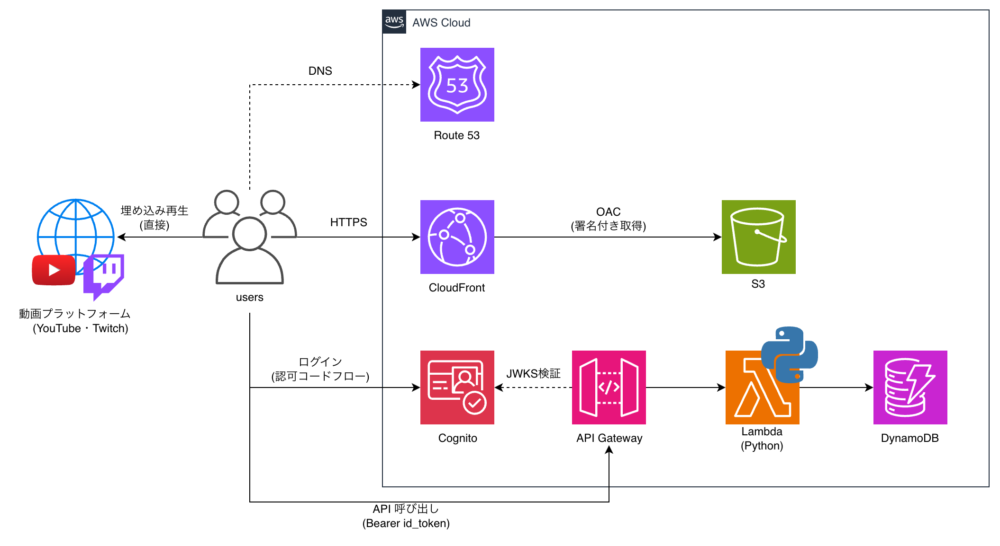

# VideoGarage

> 複数の動画プラットフォームを横断してブックマークできる、フルサーバーレス構成の動画ライブラリ

🔗 **https://videogarage.jp**


---

## 目次

- [プロジェクト概要](#プロジェクト概要)
- [なぜ作ったか](#なぜ作ったか)
- [主な機能](#主な機能)
- [使用技術](#使用技術)
- [アーキテクチャ](#アーキテクチャ)
- [技術的な意思決定](#技術的な意思決定)
- [セキュリティ対策](#セキュリティ対策)
- [データ設計](#データ設計)
- [苦労した点と解決](#苦労した点と解決)
- [Roadmap](#roadmap)
- [リポジトリ構成](#リポジトリ構成)
- [開発運用](#開発運用)

---

## プロジェクト概要

YouTube / Vimeo / Twitch / 直接mp4のURLを登録し、プレイリスト単位で整理できるWebアプリです。認証・API・データ永続化・配信までをAWSのマネージドサービスのみで構成しています（Lambda 6関数 / DynamoDB 2テーブル / IAMロール4種）。

アカウント登録なしのゲストモードでも全機能が使え、ログインするとデータがクラウドに同期されます。

---

## なぜ作ったか

「見たい動画があちこちのプラットフォームに散らばっていて、一覧で管理したい」という個人的な課題から出発しました。同時に、認証・認可・データ設計・配信・IaCといったクラウド構築の一連の要素を、チュートリアルではなく自分の課題に対して設計から運用まで通しで実践することを目的にしています。

---

## 主な機能

| 機能 | 説明 |
|------|------|
| マルチプラットフォーム対応 | YouTube / Vimeo / Twitch(配信・クリップ) / mp4 をURL判定で自動振り分け |
| プレビュー再生 | ホバーでミュート再生、クリックで固定再生 |
| プレイリスト管理 | 動画をプレイリスト単位でカテゴリ分け（作成・リネーム・削除） |
| 並び替え | ドラッグ＆ドロップで並び替え、順序はサーバーに永続化（スマホは長押しでドラッグ） |
| ゲスト / ログイン | 未ログインはローカル保存、ログインでクラウド同期 |
| データ移行 | ゲスト時のデータをログイン時に自動でクラウドへ移行 |
| セッション自動更新 | リフレッシュトークンによるサイレント更新で、操作中にログインが途切れない |

---

## 使用技術

### フロントエンド

- バニラJavaScript（フレームワーク非依存・ES Modules）
- プラットフォーム判定ロジックをモジュール分離（`platform.js`）

### バックエンド / インフラ

| サービス | 役割 |
|----------|------|
| Cognito | ユーザー認証（認可コードフロー・JWT発行・リフレッシュトークン） |
| API Gateway | HTTP API・JWTオーソライザーによる認可 |
| Lambda | Python製のCRUD処理（動画・プレイリスト各3関数） |
| DynamoDB | ユーザーデータの永続化（2テーブル・オンデマンド課金） |
| S3 + CloudFront | 静的フロントエンドの配信（OACでS3直アクセスを遮断） |
| Route53 + ACM | 独自ドメイン・HTTPS化 |
| Terraform | 全リソースのIaC管理（コンソール先行構築分をimportで回収中） |

---

## アーキテクチャ



リクエストの流れは3系統に分かれます。

1. **配信**: Route53 → CloudFront（ACM証明書でTLS終端）→ S3。S3へはOAC経由のみアクセス可能
2. **認証**: Cognito Hosted UIの認可コードフローでトークンを取得。IDトークンは30分の短命とし、リフレッシュトークンでサイレント更新
3. **API**: API GatewayのJWTオーソライザーが署名・issuer・audienceを検証してからLambdaを起動し、DynamoDBへ読み書き

動画の再生トラフィックは各プラットフォームの埋め込みプレイヤーが直接ロードするため、自前のインフラを一切通りません。再生数が増えても転送コストが発生しない構成です。

---

## 技術的な意思決定

### DynamoDB vs RDS

**DynamoDBを選択。** データ構造が「ユーザーに紐づく動画・プレイリスト」というシンプルなキー設計で、リレーションが不要なため。RDSはLambdaとのコネクション管理が煩雑になり、最小構成でも固定費が発生する。DynamoDBはオンデマンド課金でアクセスがなければコストがほぼゼロになり、サーバーレスとの親和性が高い。

### テーブル設計とユーザー間のデータ分離

エンティティ境界（プレイリスト / 動画）で2テーブルに分割し、どちらも`userId`（Cognitoの`sub`）をパーティションキーにすることで、ユーザー単位の論理分離をアプリロジックではなくキー設計そのもので担保している。1ユーザーの全件取得はQuery 1回で完結する。現状の規模ではGSIを追加せず、プレイリストによる絞り込みはクライアント側で行う判断とした。

### 認証の責務分離

API GatewayのJWTオーソライザーでトークン検証を完結させ、Lambda側には認証ロジックを持たせない設計。検証に失敗したリクエストはLambdaに到達しないため、不正トラフィックがコンピュートコストに転嫁されない。Lambdaは検証済みの`sub`（ユーザーID）を受け取るだけなので、各関数の責務がCRUDに集中する。

### セッション設計

IDトークンは30分の短命に保ち、漏えい時の被害を最小化。期限の60秒前にサイレント更新し、401時も1回だけ再取得してリトライすることで、体感上ログインが途切れないUXと短命トークンを両立している。更新処理は多重実行を1本に集約（single-flight）し、サインアウト時はリフレッシュトークンを失効させる。

### 最小権限の原則（IAM）

Lambda関数の種別ごとにロールを4分離し、必要なActionのみを許可。

| ロール | 対象関数 | 許可するAction |
|------|------|---------------|
| read | get系 2関数 | `dynamodb:Query` |
| write | post系 2関数 | `dynamodb:PutItem` |
| video-delete | 動画削除 | `dynamodb:DeleteItem` |
| tabs-delete | プレイリスト削除 | `dynamodb:Query`, `dynamodb:BatchWriteItem`（配下の動画をカスケード削除） |

### ゲストモードの設計

未ログインでもlocalStorageで全機能が使えるようにし、参入障壁を下げた。ログイン時にはローカルデータをDynamoDBへ移行する処理を実装し、ゲストからの移行体験を損なわないようにしている。

---

## セキュリティ対策

- S3はOAC（Origin Access Control）でCloudFront経由のみ許可し、バケットポリシーの`AWS:SourceArn`条件で自ディストリビューションに限定
- 認可はAPI Gateway層で完結し、未認証リクエストはLambdaを起動させない
- IAMは操作単位の4ロール分離（上表）
- フロントエンドは全属性のエスケープとイベント委譲を徹底し、URL経由のスクリプト注入（XSS）を遮断
- サインアウト時にリフレッシュトークンをrevokeし、端末に残るトークンを無効化

---

## データ設計

### VideogarageVideos

| 項目 | 型 | 説明 |
|------|-----|------|
| userId | String | パーティションキー（Cognito sub） |
| videoId | String | ソートキー |
| url | String | 動画URL |
| type | String | プラットフォーム種別 |
| tabId | String | 所属プレイリスト |
| title | String | タイトル |
| addedAt | Number | 追加日時 |
| order | Number | 並び順（ドラッグ＆ドロップの永続化に使用） |

### VideogarageTabs

| 項目 | 型 | 説明 |
|------|-----|------|
| userId | String | パーティションキー（Cognito sub） |
| tabId | String | ソートキー |
| name | String | プレイリスト名 |
| createdAt | Number | 作成日時 |

---

## 苦労した点と解決

### 1. CORSエラーによるAPI通信の失敗

フロントからAPI Gatewayへのリクエストが`Access-Control-Allow-Origin`不足でブロックされた。API GatewayのCORS設定で`Allow-Headers`にURLを誤設定していたことが原因で、`Authorization, Content-Type`に修正して解決。プリフライトリクエストの仕組みを理解するきっかけになった。

### 2. Decimal型のJSONシリアライズエラー

DynamoDBは数値を`Decimal`型で返すため、`json.dumps()`がそのまま変換できずLambdaが500を返した。`json.JSONEncoder`を継承したカスタムエンコーダーを実装して解決。

### 3. サインインのたびにプレイリストが重複生成される

ページ読み込み時にデフォルトプレイリストを作成 → ログイン時にそれがマイグレーションされ続ける、という無限増殖バグが発生。デフォルトプレイリストの生成をログイン状態の判定後に移動することで、状態管理の責務を整理して解決。

### 4. 同一URL動画の競合と、そこから見つかったXSS脆弱性

動画の一意キー（uid）をURLベースで生成していたため、別プレイリストに同じ動画を追加すると同一扱いになり削除が連動する不具合が発生。調査の過程で、URL全体がuidとしてHTML属性へ未エスケープのまま展開されており、細工したURLでスクリプト注入が成立し得ることも判明した。uidを乱数ベースに変更して重複チェックは`動画ID + プレイリストID`に分離し、全属性のエスケープとインラインイベントハンドラの全廃（イベント委譲への移行）で機能バグと脆弱性の両方を解決した。

### 5. リロードのたびにログアウトされる

有効なはずのセッションがページ再読み込みで消える現象が発生。原因はJWTのペイロードがbase64url形式（`-`と`_`を含む）なのに対し、素の`atob()`が標準base64しか受け付けず、デコード例外を「期限切れ」と誤判定していたこと。base64url→base64の変換とパディング補完を実装して解決した。エンコーディング仕様の差異を意識する契機になった。

---

## Roadmap

| 項目 | ステータス | 内容 |
|------|-----------|------|
| Terraform化 | 🚧 実装中 | コンソールで先行構築したリソースを`terraform import`でIaC管理下に回収中。完了後は`plan`差分ゼロを維持し、`terraform apply`で環境を再現可能にする |
| CI/CD | 📋 予定 | GitHub Actionsで`main`マージ時に`fmt / validate / plan`の検証とS3同期・CloudFrontキャッシュ無効化・Lambda更新を自動化 |
| 未対応URLの動的承認 | 📋 予定 | 未対応プラットフォームのURLをSlackに通知し、承認制で許可リストに追加 |

---

## リポジトリ構成

```
.
├── frontend/        # 静的フロントエンド（Vanilla JS / ES Modules）
├── backend/
│   └── lambda/      # Lambda関数（Python） tabs/ videos/
├── infra/           # Terraform
└── docs/            # アーキテクチャ図・ドキュメント
```

---

## 開発運用

- **Conventional Commits** に準拠したコミットメッセージ（日本語）
- **feature ブランチ + Squash Merge** によるGitフロー
- **GitHub Issues** でタスク管理

